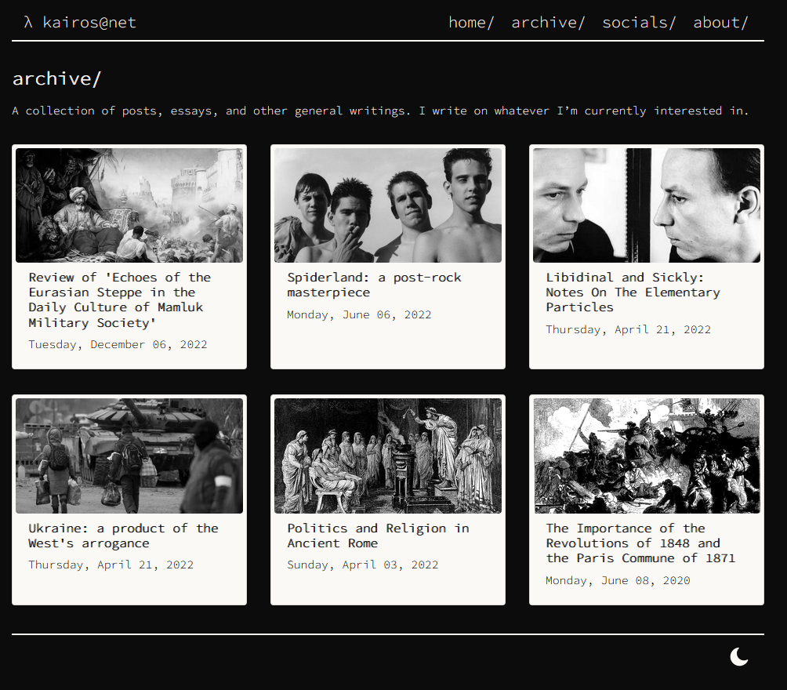

### [kairos@net](https://kairosjk.github.io/)

A small personal site/blogsite for my essays and interests, using hugo and bootstrap.

Feel free to fork or take from the theme whatever you want, most of the direct styling and designing can be found in [layouts/](https://github.com/KairosJK/kairosjk.github.io/tree/master/layouts) and bootstrap overrides in [static/css/base.css](https://github.com/KairosJK/kairosjk.github.io/blob/caa638be56407ac22bc0968dca40ac7d924df134/static/css/base.css).

I have created my own theme, which for the time being I'm nicknaming "gothic" (because it reminds me of [bauhaus](https://en.wikipedia.org/wiki/Bauhaus_(band))). I may generalize it later and bundle it as a separate hugo "theme".